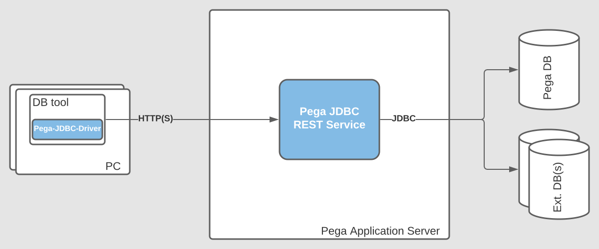

# Pega JDBC driver

## Overview

Pega JDBC driver allows you to access to remote SQL databases behind Pega applications via your favorite DB tool which
supports custom JDBC drivers, e.g. [DBeaver](https://github.com/dbeaver/dbeaver).

## Architecture



## Build

Prerequisites:

1. Java (JDK) 11 or later.
2. Apache Maven 3.6+
3. Internet access
4. Git client

Build

```
git clone https://github.com/AttilaBecsvardi/pega-jdbc-driver pega-jdbc-driver
cd pega-jdbc-driver
mvn package
```

Binaries are in target folder.

## Download

You can also download prebuilt binaries directly
from [GitHub releases](https://github.com/AttilaBecsvardi/pega-jdbc-driver/releases).

## Installation
