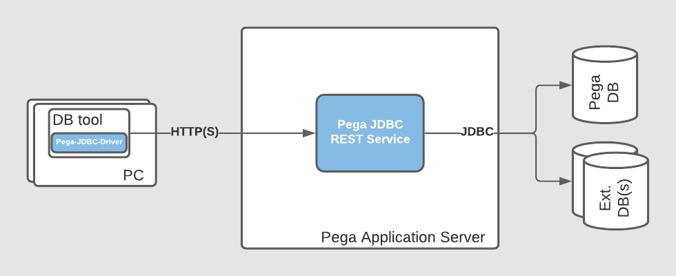
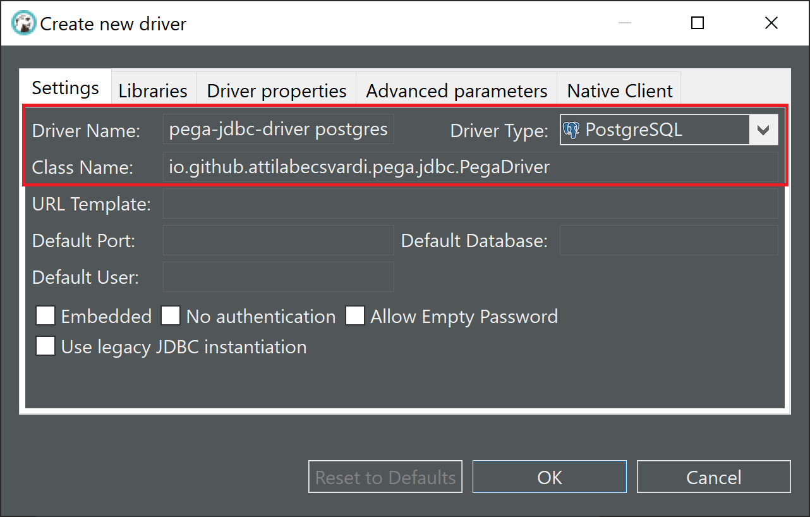
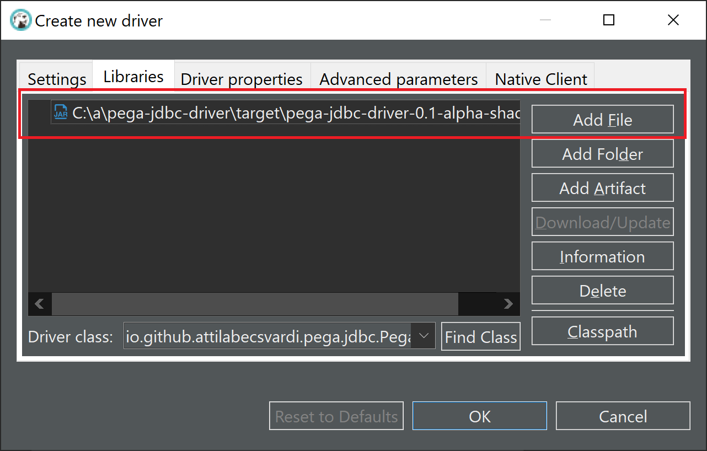
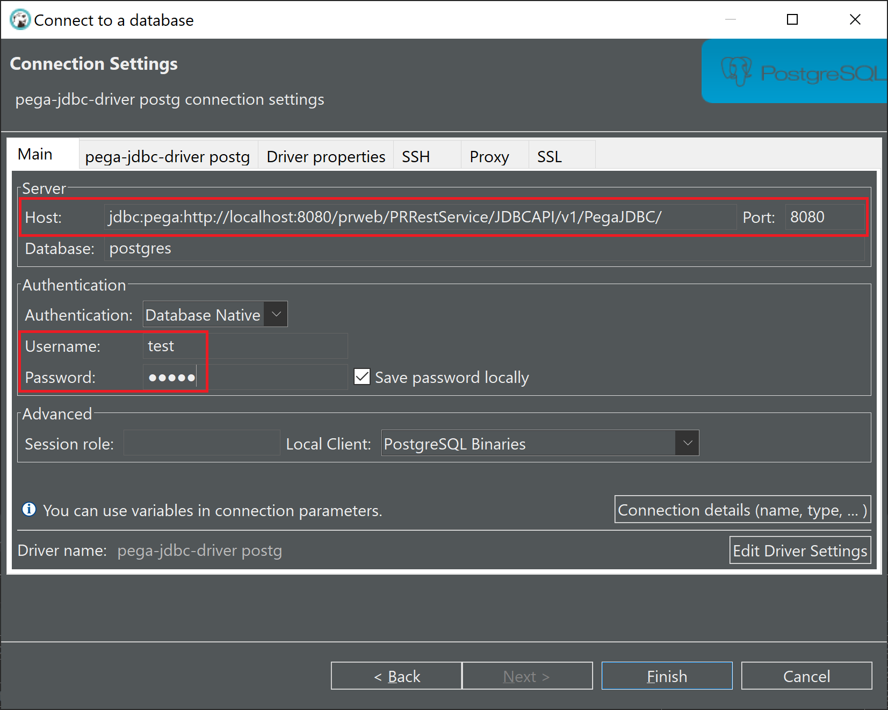
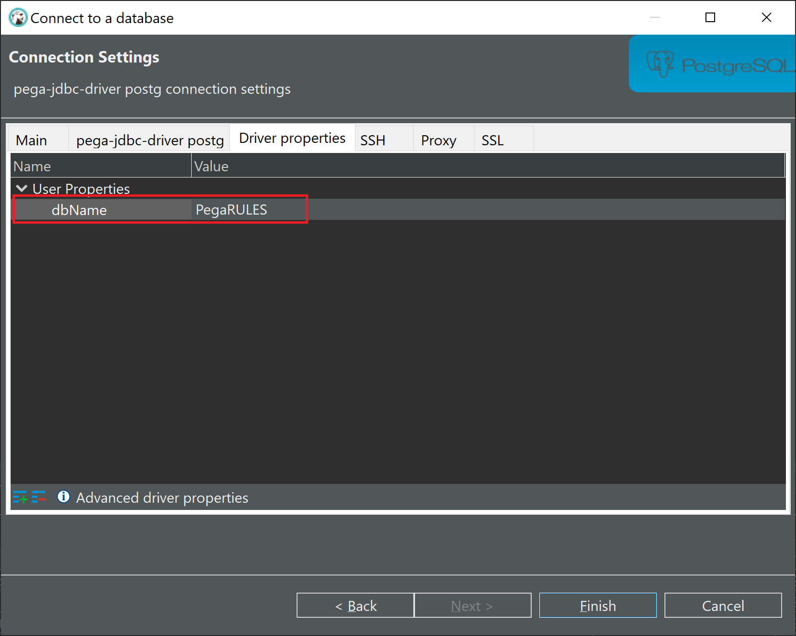
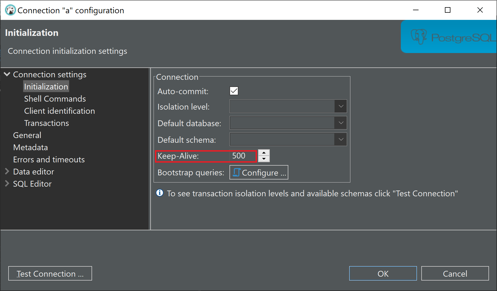
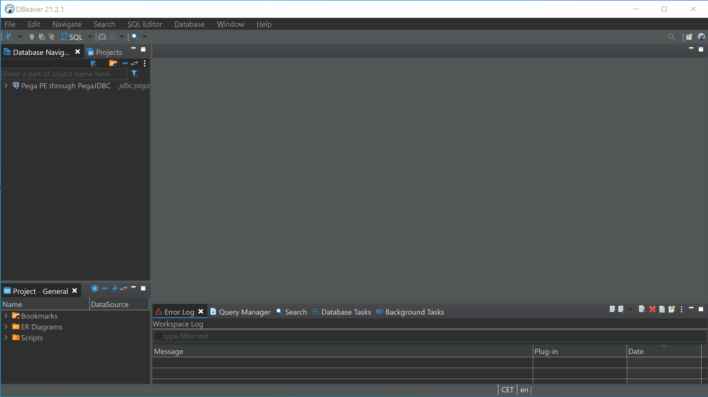

# Pega JDBC driver

## Overview

Pega JDBC driver allows you to access remote SQL databases behind Pega applications with your favorite DB tool which
supports custom JDBC drivers, e.g. [DBeaver](https://github.com/dbeaver/dbeaver).

This solution has two main components:

- pega-jdbc-driver: implemented in java, it manages communication between the DB-tool and Pega Rest service.
- MyPegaJDBC Pega application: it provides a REST service that processes the requests of the JDBC client

## Architecture




## Build

Prerequisites:

1. Java (JDK) 11 or later.
2. Apache Maven 3.6+
3. Internet access
4. Git client

Build

```
git clone https://github.com/AttilaBecsvardi/pega-jdbc-driver pega-jdbc-driver
cd pega-jdbc-driver
mvn package
```

Binaries are in `target` folder. You will need the Uber JAR, it's called `pega-jdbc-driver-<version>-shaded.jar`.

## Download

You can also download prebuilt binaries directly
from [GitHub releases](https://github.com/AttilaBecsvardi/pega-jdbc-driver/releases).

## Installation

### Prerequisites

1. [Build](#Build) or [download](https://github.com/AttilaBecsvardi/pega-jdbc-driver/releases) `pega-jdbc-driver.jar`
2. [Download](https://github.com/AttilaBecsvardi/pega-jdbc-driver/releases) MyPegaJDBC Pega application
3. Download and install your favorite DB tool  
   *Note: here I'll use [DBeaver Community](https://dbeaver.io/download/) for demonstration*

### Installing MyPegaJDBC Pega application

1. Log in to your target Pega Platform (`https://<hostname>:<port>/prweb`) by entering the administrator ID
2. In the header of Dev Studio, click **Configure -> Application -> Distribution -> Import**
3. Select the `MyPegaJDBC_xx-xx-xx_*.zip` file from your hard drive, and then follow the wizard instructions
4. When the import is complete, click **Done**
5. *Optional:* Open JDBCAPI Service Package and disable `Require TLS/SSL for REST services in this package` if your
   server does not support HTTPS (only for dev)

### Configuring Pega

#### Adding a new Operator

The new Operator will be used to connect to Pega from the DB tool.
> ***Before you begin**: To create an operator ID, you must have the pxCanManageUsers privilege, which is part of the PegaRULES:SecurityAdministrator role.*

1. Click **Configure -> Org & Security -> Organization -> Organizational Chart**
2. Open the Organization, Division, or Organization Unit rule form (i.e `pega.com • Administration • Installation`), and
   go to the **Chart** tab
3. Right-click to open the pop-up panel, and click **Add Operator**
4. Enter any missing organization information. Enter an operator ID, password, and full name.  
   Select the `MyPegaJDBC:Administrators` access group. All values are required
5. Click **OK** to create the operator ID instance

### Configuring DBeaver

#### Adding a new driver configuration

Please find the link below for the official Wiki page:  
https://dbeaver.com/docs/wiki/Database-drivers/

Just a few words about drivers before you start.  
Basically, there are two main options, either you can use a Generic driver or a vendor-specific driver. The latter
option is the preferred one because it allows DBeaver to use vendor-specific queries, such as retrieving metadata for
database objects and these queries provide more details.  
In order to add a vendor-specific driver, you need to know the type of target database behind your Pega platform (i.e
Oracle, Postgres, MSSQL, etc).  
If you don't know the available databases and their types then you can find a mini tool in MyPegaJDBC application which
can help you out.

1. Log in to your target Pega Platform (`https://<hostname>:<port>/prweb`) by entering your previously created Operator
2. Click **Configure -> My Pega JDBC -> DB Info**
3. Select the database from the dropdown menu and note the **Database Type** field

Ok, you can now add the new driver configuration in DBeaver.

1. Click **Database -> Driver Manager** and click on the **New** button
2. Enter **Driver Name**, **Driver Type** and set **Class Name** to `io.github.attilabecsvardi.pega.jdbc.PegaDriver`
   
3. Switch to **Libraries** tab and click **Add File** to add `pega-jdbc-driver.jar` jar file  
   
4. Click **OK** and **Close** Driver Manager

#### Adding a new database connection

1. Click **File -> New -> Dbeaver -> Database Connection**
2. Select your previously added driver (i.e `pega-jdbc-driver postgres`)
3. Enter **Host** url (i.e `jdbc:pega:http://localhost:8080/prweb/PRRestService/JDBCAPI/v1/PegaJDBC/`) and **Port** (
   i.e `8080`)  
   Enter the previously created Pega Operator **Username** and **Password**  
   
4. Switch to **Driver properties** tab and add a new property  
   `Property Name = dbName`  
   `Property Value = <target_database> (i.e PegaRULES)`
   > ***Hint:** check **DB Info** landing page for the available DBs*

   
5. Click **Finish**
6. Select the newly created DB connection in the **Database Navigator** and press **F4** to open Connection properties
   dialog!  
   Select **Initialization** and set **Keep-Alive**  
   

   > ***Note:** Keep-Alive is required to prevent Pega Requestor passivation.  
   Pega uses passivation to improve system performance by removing pages from the clipboard that have not been accessed by a requestor for a specified period of time. Normally, this feature is useful and works well but in our case, we store different non-serializable Java objects on the clipboard and therefore the passivation fails. We don't want to completely disable this feature in Pega instead of using keep-alive messages.  
   For APP requestor type, the default passivation timeout is `600` seconds, so the keep-alive value must be less than this.*
7. *Optional:* Set your preferred **Connection Name** under **General**

## Done



## Uninstallation

still in progress ...

## Unit Tests (JUnit5)

Prerequisites

1. A running Pega Platform(e.g Pega Personal Edition) with MyPegaJDBC application
2. PostgreSQL as background DB (Note: dbType introduced in properties file but not implemented yet)
3. Edit `test/resources/unit_test.properties` to set connection details

## References

- [H2 database](https://github.com/h2database/h2database)
- [AceQL Client JDBC Driver](https://github.com/kawansoft/aceql-http-client-jdbc-driver)
- [PostgreSQL JDBC Driver](https://github.com/pgjdbc/pgjdbc)
- [CSV JDBC driver](https://github.com/peterborkuti/csv-jdbc-driver)